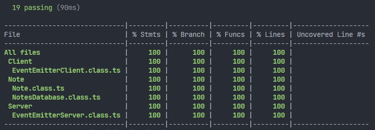
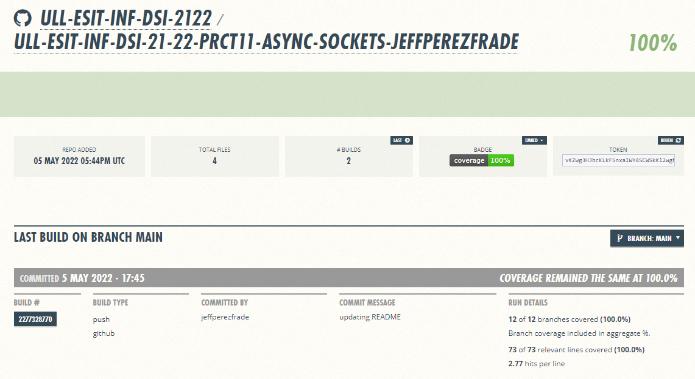
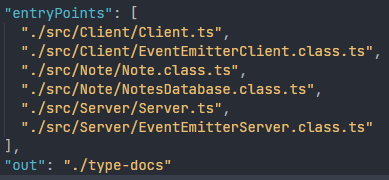
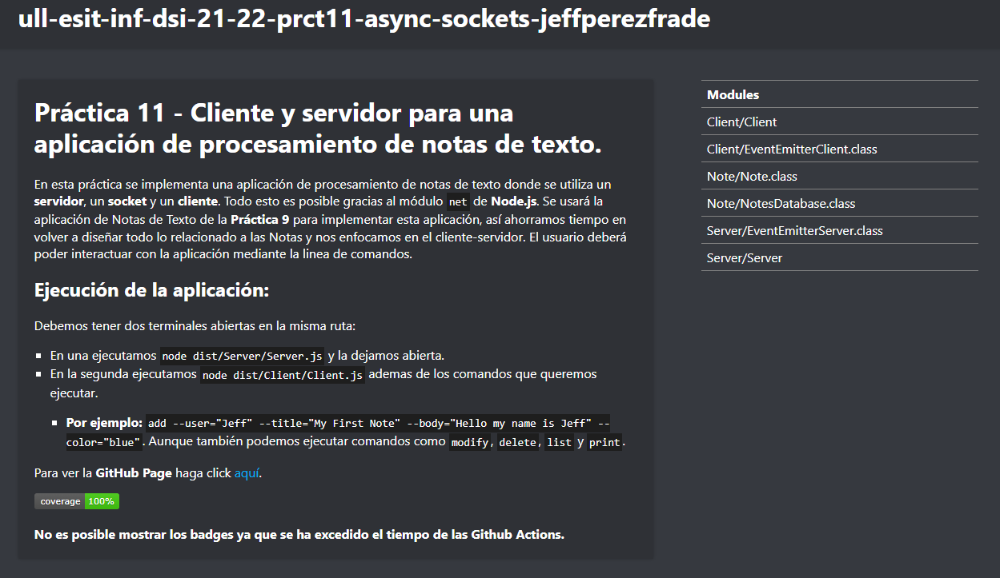

# Informe Práctica 11 - Cliente y servidor para una aplicación de procesamiento de notas de texto.

# 1.Introducción.
---
En esta práctica se implementa una aplicación de procesamiento de notas de texto donde se utiliza un **servidor**, un **socket** y un **cliente**. Todo esto es posible gracias al módulo `net` de **Node.js**.

Se usará la aplicación de Notas de Texto de la **Práctica 9** para implementar esta aplicación, así ahorramos tiempo en volver a diseñar todo lo relacionado a las Notas y nos enfocamos en el cliente-servidor. El usuario deberá poder interactuar con la aplicación mediante la linea de comandos.

# 2. Objetivos.
---
Tendremos como objetivo:
* Saber utilizar la clase **EventEmitter** proporcionada por el módulo **Events**.
* Aprender a utilizar el módulo `net` de **Node.js**.
* Aprender a trabajar con **sockets** para las operaciones **cliente-servidor**.

# 3. Ejercicio - Aplicación de procesamiento de notas de texto.
---
Los requisitos que debe cumplir la aplicación de procesamiento de notas de texto son los enumerados a continuación:
1. La aplicación de notas deberá permitir que múltiples usuarios interactúen con ella.
2. Una nota estará formada, como mínimo, por un título, un cuerpo y un color (rojo, verde, azul o amarillo).
3. Cada usuario tendrá su propia lista de notas, con la que podrá llevar a cabo las siguientes operaciones:

* Añadir una nota a la lista. Antes de añadir una nota a la lista se debe comprobar si ya existe una nota con el mismo título. En caso de que así fuera, deberá mostrarse un mensaje de error por la consola del cliente. En caso contrario, se añadirá la nueva nota a la lista y se mostrará un mensaje informativo por la consola del cliente.

* Modificar una nota de la lista. Antes de modificar una nota, previamente se debe comprobar que exista una nota con el título de la nota a modificar en la lista. Si existe, se procede a su modificación y se emite un mensaje informativo por la consola del cliente. En caso contrario, debe mostrarse un mensaje de error por la consola del cliente.

* Eliminar una nota de la lista. Antes de eliminar una nota, previamente se debe comprobar que exista una nota con el título de la nota a eliminar en la lista. Si existe, se procede a su eliminación y se emite un mensaje informativo por la consola del cliente. En caso contrario, debe mostrarse un mensaje de error por la consola del cliente.

* Listar los títulos de las notas de la lista. Los títulos de las notas deben mostrarse por la consola del cliente con el color correspondiente de cada una de ellas. Use el paquete `chalk` para ello.

* Leer una nota concreta de la lista. Antes de mostrar el título y el cuerpo de la nota que se quiere leer, se debe comprobar que en la lista existe una nota cuyo título sea el de la nota a leer. Si existe, se mostrará el título y cuerpo de la nota por la consola del cliente con el color correspondiente de la nota. Para ello, use el paquete `chalk`. En caso contrario, se mostrará un mensaje de error por la consola del cliente.

* Todos los mensajes informativos se mostrarán con color verde, mientras que los mensajes de error se mostrarán con color rojo. Use el paquete `chalk` para ello.

* El servidor es responsable de hacer persistente la lista de notas de cada usuario.
  * Guardar cada nota de la lista en un fichero con formato JSON. Los ficheros JSON correspondientes a las notas de un usuario concreto deberán almacenarse en un directorio con el nombre de dicho usuario.
  * Cargar una nota desde los diferentes ficheros con formato JSON almacenados en el directorio del usuario correspondiente.

4. Un usuario solo puede interactuar con la aplicación de procesamiento de notas de texto a través de la línea de comandos del cliente. Los diferentes comandos, opciones de los mismos, así como manejadores asociados a cada uno de ellos deben gestionarse mediante el uso del paquete `yargs`.

### Ejercicio resuelto:
---

**Clase NotesDatabase:**

```ts
import * as fs from 'fs';
import * as chalk from 'chalk';
import {Note} from './Note.class';
/**
 * Class to control de Notes Database.
 */
export class NotesDatabase {
  constructor() {
    // Empty constructor comment due to Code Smells.
  }
  /**
   * Method to add a Note to the database.
   * @param note Note to add.
   * @returns Returns a boolean of success.
   */
  public addNote(note: Note): boolean {
    if (fs.existsSync(`database/${note.user}/${note.title}.json`)) {
      console.log(chalk.red(`The note already exists!`));
      return false;
    }
    const structureJSON: string = `{"title": "${note.title}", "body": "${note.body}", "color": "${note.color}"}`;
    if (fs.existsSync(`database/${note.user}`)) {
      fs.appendFileSync(`database/${note.user}/${note.title}.json`, structureJSON);
    } else {
      fs.mkdirSync(`database/${note.user}`, {recursive: true});
      fs.appendFileSync(`database/${note.user}/${note.title}.json`, structureJSON);
    }
    console.log(chalk.green(`${note.title} note added to ${note.user} folder!`));
    return true;
  }
  /**
   * Method that modify a note from the database.
   * @param note Note to modify.
   * @returns Returns a boolean of success.
   */
  public modifyNote(note: Note): boolean {
    if (!fs.existsSync(`database/${note.user}/${note.title}.json`)) {
      console.log(chalk.red(`Error: ${note.title} does not exist!`));
      return false;
    } else {
      const structureJSON: string = `{"title": "${note.title}", "body": "${note.body}", "color": "${note.color}"}`;
      fs.writeFileSync(`database/${note.user}/${note.title}.json`, structureJSON);
      console.log(chalk.green(`${note.title} modified!`));
      return true;
    }
  }
  /**
   * Method that delete a note from the database.
   * @param note Note to delete.
   * @returns Returns a boolean of success.
   */
  public deleteNote(note: Note): boolean {
    if (!fs.existsSync(`database/${note.user}/${note.title}.json`)) {
      console.log(chalk.red(`Error: ${note.title} does not exist!`));
      return false;
    } else {
      fs.rmSync(`database/${note.user}/${note.title}.json`);
      console.log(chalk.green(`${note.title} note deleted!`));
      return true;
    }
  }
  /**
   * Method that list all the notes of an user.
   * @param user User which all notes will be listed.
   * @returns Array of notes that belongs to the user.
   */
  public listNotes(user: string): Note[] {
    if (!fs.existsSync(`database/${user}`)) {
      console.log(chalk.red(`Error: User ${user} not found!`));
      return [];
    } else {
      const totalFiles: string[] = fs.readdirSync(`database/${user}`);
      const notes: Note[] = [];
      totalFiles.forEach((file) => {
        const content: string = fs.readFileSync(`database/${user}/${file}`, {encoding: 'utf-8'});
        const parsedJSON = JSON.parse(content);
        notes.push(new Note(user, parsedJSON.title, parsedJSON.body, parsedJSON.color));
      });
      return notes;
    }
  }
  /**
   * Method that print a note.
   * @param note Note to be printed.
   * @returns Returns the note to be printed or a success boolean.
   */
  public printNote(note: Note): Note | boolean {
    if (!fs.existsSync(`database/${note.user}/${note.title}.json`)) {
      console.log(chalk.red(`Error: ${note.title} does not exist!`));
      return false;
    } else {
      const content: string = fs.readFileSync(`database/${note.user}/${note.title}.json`, {encoding: 'utf-8'});
      const parsedJSON = JSON.parse(content);
      const newNote: Note = new Note(note.user, parsedJSON.title, parsedJSON.body, parsedJSON.color);
      return newNote;
    }
  }
}
```
**Explicación de NotesDatabase:**

Esta clase es casi idéntica a la realizada en la **Práctica 9** [(GitHub Page)](https://ull-esit-inf-dsi-2122.github.io/ull-esit-inf-dsi-21-22-prct09-filesystem-notes-app-jeffperezfrade/), así que no será necesario explicar nuevamente lo que realizan cada uno de los métodos. La modificación ha sido que esta vez hemos utilizado pruebas **TDD** por lo que ha sido necesario devolver un valor. También es necesario para que el **servidor** sepa si las operaciones realizadas han sido **satisfactorias**, en caso de que no, manejar los errores correctamente.

**Clase Note:**

```ts
/**
 * Different note colors.
 */
export type Colors = 'yellow' | 'blue' | 'red' | 'green';
/**
 * This class stands for the notes sended.
 */
export class Note {
  /**
   * Attributes.
   */
  private _user: string;
  private _title: string;
  private _body: string;
  private _color: Colors;
  /**
   * Note class constructor.
   * @param user User name.
   * @param title Note title.
   * @param body Note body (information inside).
   * @param color Note color ('yellow' | 'blue' | 'red' | 'blue').
   */
  constructor(
      user: string,
      title: string,
      body: string,
      color: Colors,
  ) {
    this._user = user;
    this._title = title;
    this._body = body;
    this._color = color;
  }
  /**
   * User name getter.
   * @returns Note user name.
   */
  get user(): string {
    return this._user;
  }
  /**
   * Title getter.
   * @returns Note title.
   */
  get title(): string {
    return this._title;
  }
  /**
   * Body getter.
   * @returns Note body.
   */
  get body(): string {
    return this._body;
  }
  /**
   * Color getter.
   * @returns Note color.
   */
  get color(): Colors {
    return this._color;
  }
}
```

**Explicación de Note:**
Esta clase da una idea de como serán las Notas de cada usuario, cuya estructura viene formada por el nombre de usuario `user`, el título `title`, el cuerpo de la nota `body` y el color de la nota `color`. Esta última viene dada por un objeto llamado `Colors` el cual engloba a los únicos colores que serán posibles para las notas.

También se añaden métodos `getters` para poder utilizarlos fuera de esta clase, ya que los atributos son privados. **Cabe recalcar** que se ha utilizado el nuevo estilo de **ES6** `get user()` para así poder obtener el atributo de la forma `nota.user` y tener un código más legible.

**Cliente:**

```ts
import * as yargs from 'yargs';
import * as chalk from 'chalk';
import * as net from 'net';
import {EventEmitterClient} from './EventEmitterClient.class';
import {Colors} from '../Note/Note.class';
/**
 * Types given by the professor.
 * 'User' field added.
 */
export type RequestType = {
  type: 'add' | 'modify' | 'delete' | 'print' | 'list';
  user: string;
  title?: string;
  body?: string;
  color?: Colors;
}
/**
 * Type by default.
 */
let request: RequestType = {
  type: 'add',
  user: '',
};
/**
 * Client connected to 60300 port.
 */
const client = net.connect({port: 60300});
/**
 * Object of EventEmitterClient class.
 */
const socket = new EventEmitterClient(client);

/**
 * Command line for add a note.
 */
yargs.command({
  command: 'add',
  describe: 'Add a new note',
  builder: {
    user: {
      describe: 'User who is going to add the note',
      demandOption: true,
      type: 'string',
    },
    title: {
      describe: 'The title of the note',
      demandOption: true,
      type: 'string',
    },
    body: {
      describe: 'The text of the note',
      demandOption: true,
      type: 'string',
    },
    color: {
      describe: 'The color of the note',
      demandOption: true,
      type: 'string',
    },
  },
  handler(argv) {
    if (typeof argv.body === 'string' && typeof argv.title === 'string' && typeof argv.user === 'string' && typeof argv.color === 'string') {
      if (argv.color == 'red' || argv.color == 'green' || argv.color == 'blue' || argv.color == 'yellow') {
        request = {
          type: 'add',
          user: argv.user,
          title: argv.title,
          body: argv.body,
          color: argv.color,
        };
      } else {
        console.log(chalk.red(`Error: Colors supported => red, green, blue, or yellow.`));
      }
    }
  },
});
/**
 * Command line for modify a note.
 */
yargs.command({
  command: 'modify',
  describe: 'Modify a note',

  builder: {
    user: {
      describe: 'User who is going to modify a note',
      demandOption: true,
      type: 'string',
    },

    title: {
      describe: 'The title of the note',
      demandOption: true,
      type: 'string',
    },

    body: {
      describe: 'The text of the note',
      demandOption: true,
      type: 'string',
    },

    color: {
      describe: 'The color of the note',
      demandOption: true,
      type: 'string',
    },
  },
  handler(argv) {
    if (typeof argv.body === 'string' && typeof argv.color === 'string' &&
          typeof argv.user === 'string' && typeof argv.title === 'string') {
      if (argv.color != 'red' && argv.color != 'green' && argv.color != 'blue' && argv.color != 'yellow') {
        console.log(chalk.red(`Error: Colors supported => red, green, blue, or yellow.`));
      } else {
        request = {
          type: 'modify',
          user: argv.user,
          title: argv.title,
          body: argv.body,
          color: argv.color,
        };
      }
    }
  },
});
/**
 * Command line for delete a note.
 */
yargs.command({
  command: 'delete',
  describe: 'Delete a note',
  builder: {
    user: {
      describe: 'User who is going to delete the note',
      demandOption: true,
      type: 'string',
    },
    title: {
      describe: 'The title of the note',
      demandOption: true,
      type: 'string',
    },
  },
  handler(argv) {
    if (typeof argv.title === 'string' && typeof argv.user === 'string') {
      request = {
        type: 'delete',
        user: argv.user,
        title: argv.title,
      };
    }
  },
});
/**
 * Command line for list an user notes.
 */
yargs.command({
  command: 'list',
  describe: 'List the titles of the notes',
  builder: {
    user: {
      describe: 'User who will show his notes',
      demandOption: true,
      type: 'string',
    },
  },
  handler(argv) {
    if (typeof argv.user === 'string') {
      request = {
        type: 'list',
        user: argv.user,
      };
    }
  },
});
/**
 * Command line for print a note.
 */
yargs.command({
  command: 'print',
  describe: 'Print a specific note from the list',
  builder: {
    user: {
      describe: 'User who will print a note',
      demandOption: true,
      type: 'string',
    },
    title: {
      describe: 'The title of the note',
      demandOption: true,
      type: 'string',
    },
  },
  handler(argv) {
    if (typeof argv.user === 'string' && typeof argv.title === 'string') {
      request = {
        type: 'print',
        user: argv.user,
        title: argv.title,
      };
    }
  },
});
/**
 * Process the arguments passed from the command line to the application.
 */
yargs.parse();
/**
 * We send the message to the server.
 */
client.write(JSON.stringify(request) + `\n`, (error) => {
  if (error) {
    console.log(chalk.red(`Error: The note cannot be sent!`));
  }
});
/**
 * We process the response.
 */
socket.on('message', (JSONRequest) => {
  switch (JSONRequest.type) {
    case 'add':
      if (JSONRequest.success) {
        console.log(chalk.green('New note added!'));
      } else {
        console.log(chalk.red('Note title taken! '));
      }
      break;
    case 'modify':
      if (JSONRequest.success) {
        console.log(chalk.green('Note modified!'));
      } else {
        console.log(chalk.red('The note you want to modify does not exist!'));
      }
      break;
    case 'delete':
      if (JSONRequest.success ) {
        console.log(chalk.green('Note deleted!') );
      } else {
        console.log(chalk.red('Note not found'));
      }
      break;
    case 'list':
      if (JSONRequest.success) {
        console.log('Your notes are: ');
        JSONRequest.notes.forEach((note: any) => {
          console.log(chalk.keyword(note.color)(note.title));
        });
      } else {
        console.log(chalk.red('You have never saved a note!') );
      }
      break;
    case 'print':
      if (JSONRequest.success) {
        console.log(chalk.keyword(JSONRequest.notes[0].color)(JSONRequest.notes[0].title + '\n' + JSONRequest.notes[0].body));
      } else {
        console.log(chalk.red('Note not found!') );
      }
      break;
    default:
      console.log(chalk.red('Error: Command not supported!'));
      break;
  }
});
/**
 * Check if there is any connection error.
 */
client.on( 'error', (err) => {
  console.log(`Error: Connection failed!: ${err.message}` );
});
```

**Explicación de Cliente:**

Aquí se gestionan los comandos que el usuario introducirá a la aplicación. Empezamos usando la función `connect` del módulo `net` de Node.js, esta recibe un objeto con toda la información de la conexión a la misma vez que retorna un **Socket**. Luego se crea un objeto de la clase `EventEmitterClient` llamado `socket` el cual nos va a permitir procesar la respuesta del servidor. Posteriormente se crea una variable del tipo `RequestType` proporcionada por el profesor donde incluyen los elementos que la petición debe tener. Esto se realiza con ayuda del paquete `yargs` para recoger los comandos que el usuario introduzca por consola, según que comando se introduzca se establecen los valores correspondientes dentro de `request`.

Después de que se procesen los comandos con `yargs.parse()` y se escriben en el `socket` del cliente con el método `write`. Véase que se utiliza la función `stringify` para deserializar el objeto JSON.

Cada vez que se recibe un mensaje completo del servidor, se ejecuta un manejador de la clase `EventEmitterClient` del tipo `message`. La respuesta del servidor se obtiene en `JSONRequest`, por lo que podemos acceder a la propiedad `type` de este objeto y mostrar un mensaje por consola dependiendo de la propiedad `success`. En caso de que se produzca un error se maneja con el evento `error` al final del archivo. 


**Clase EventEmitterClient:**

```ts
import {EventEmitter} from 'events';
/**
 * This class emit a message event.
 */
export class EventEmitterClient extends EventEmitter {
  /**
   * This constructor receives parts of one message with a data event, finally it emits a message event
   * to indicate that the complete message is received.
   * @param connection object of EventEmitter used as a socket.
   */
  constructor(connection: EventEmitter) {
    super();

    let response: string = '';
    connection.on('data', (resChunk) => {
      response += resChunk;
    });

    connection.on('end', () => {
      this.emit('message', JSON.parse(response));
    });
  }
}
```

**Explicación de EventEmitterClient:**

Esta clase hereda de `EventEmitter` ya que será utilizada por el cliente para la comunicación con el servidor. Cada vez que recibe un mensaje enviado por el servidor a través del socket, este emite un evento `message` cuando recibe un **mensaje completo**.

* `constructor` tiene el parámetro `EventEmitter` llamado `connection`. El manejador se ejecuta con cada emisión de `data` y se almacena en `response` como un mensaje completo recibido en partes desde el servidor. Si se recibe un evento `end` entonces el servidor no ha terminado de enviar la respuesta, entonces se emite de nuevo un evento de tipo `message` junto con el mensaje completo para comunicar que ya se tiene la respuesta completa. Se utiliza la función `JSON.parse` para que `response` sea un objeto **JSON** correcto.

**Server:**

```ts
import * as net from 'net';
import * as chalk from 'chalk';
import {Note} from '../Note/Note.class';
import {NotesDatabase} from '../Note/NotesDatabase.class';
import {EventEmitterServer} from './EventEmitterServer.class';
/**
 * Types given by the professor.
 */
export type ResponseType = {
  type: 'add' | 'modify' | 'delete' | 'print' | 'list';
  success: boolean;
  notes?: Note[];
}
/**
 * Creating net module.
 */
const server = net.createServer((connection) => {
  /**
   * Object from EventEmitterServer class.
   */
  const socket = new EventEmitterServer(connection);

  console.log(chalk.green(`Client connected!`));

  /**
   * When the request event is received, the message sent by the client is processed.
   */
  socket.on('request', (note) => {
    const database = new NotesDatabase();
    const response: ResponseType = {
      type: 'add',
      success: true,
    };
    switch (note.type) {
      case 'add':
        // const newNote = new Note(note.user, note.title, note.body, note.color);
        if (!database.addNote(note)) {
          response.success = false;
        }
        break;
      case 'modify':
        response.type = 'modify';
        if (!database.modifyNote(note)) {
          response.success = false;
        }
        break;
      case 'delete':
        response.type = 'delete';
        if (!database.deleteNote(note)) {
          response.success = false;
        }
        break;
      case 'list':
        response.type = 'list';
        const listNotes: Note[] = database.listNotes(note.user);
        if (listNotes.length == 0) {
          response.success = false;
        } else {
          response.notes = listNotes;
        }
        break;
      case 'print':
        response.type = 'print';
        const cont = database.printNote(note);
        if (cont == false) {
          response.success = false;
        } else if (typeof cont !== 'boolean') {
          response.notes = [cont];
        }
        break;
      default:
        console.log(chalk.red(`Error: Command not supported!`));
        break;
    }

    /**
     * We send the response to the client.
     */
    connection.write(JSON.stringify(response), (error) => {
      if (error) {
        console.log(chalk.red(`Error: Response not sent!`));
      } else {
        console.log(chalk.green(`Response sent!`));
        connection.end();
      }
    });
  });

  /**
   * Error handle.
   */
  connection.on('error', (err) => {
    if (err) {
      console.log(`Connection failed! - ${err.message}`);
    }
  });

  /**
   * Inform when a client disconnect.
   */
  connection.on('close', () => {
    console.log(chalk.green(`Client disconnected.`));
  });
});

/**
 * Server is listening on port 60300.
 */
server.listen(60300, () => {
  console.log(chalk.green(`Waiting clients...\n`));
});
```

**Explicación de Server:**

Primero nos encontramos con `ResponseType` proporcionada por el profesor donde incluyen los elementos que la respuesta debe tener. Luego se utiliza el método `createServer` del módulo `net` el cual recibe un manejador y devuelve un objeto de tipo `Server`. `Connection` es un `socket` que se encargará de la comunicación de  los clientes con el servidor. Este `socket` es un objeto de la clase `EventEmitterServer` y se utiliza para definir un manejador que se ejecuta cada vez que se recibe un evento `request` o una petición por parte del cliente. Seguidamente se crea un objeto `database` de la clase `NotesDatabase` que se encargará de gestionar el directorio con las notas de los usuarios. 

`response` es una variable del tipo `ResponseType` que será la respuesta enviada por el cliente, esta por defecto tendrá el tipo `add` y tendrá el campo `success` a `true`. Acto seguido se hace un estudio del `note.type` para saber que se ha realizado por parte del cliente. En función de su valor y lo que devuelvan los métodos de la clase `NotesDatabase` se establecen correctamente las propiedades de `response`.

Cuando llega el momento de enviarle una respuesta al cliente, se utiliza el método `write`. En caso de que se realice correctamente, se cierra el servidor mediante la función `connection.end()` por parte del cliente.

Por último se maneja en caso de `error` en la conexión y así poder controlarlo fácilmente. Luego añadimos el evento `close` para cuando el cliente se desconecta.

La función `listen` especifica por que puerto estará escuchando el servidor, en este caso será el puerto **60300** donde los clientes tendrán que conectarse.

**Clase EventEmitterServer:**

```ts
import {EventEmitter} from 'events';
/**
 * This class emits a request.
 * It extends from EventEmitter.
 */
export class EventEmitterServer extends EventEmitter {
  /**
   * Constructor that receives a message in parts.
   * If there is a end of line jump, we know there is a completed message.
   * Then a request event is emitted.
   * @param connect Used as a socket.
   */
  constructor(connect: EventEmitter) {
    super();
    let msg: string = '';
    connect.on('data', (msgChunk) => {
      msg += msgChunk;
      let limit: number = msg.indexOf('\n');
      while (limit !== -1) {
        const auxMsg = msg.substring(0, limit);
        msg = msg.substring(limit + 1);
        this.emit('request', JSON.parse(auxMsg));
        limit = msg.indexOf('\n');
      }
    });
  }
}
```

**Explicación de EventEmitterServer:**

Esta clase hereda de `EventEmitter` y será utilizada por el servidor para comunicarse adecuadamente con el cliente cada vez que emite un tipo `request`. Este evento lo emite cada vez que este recibe una petición completa a través del socket. El parámetro `connection` del `constructor` es un objeto de la clase `EventEmitter`. Dentro tenemos un manejador que con cada evento `data` se ejecuta y almacenamos el resultado en la variable `msg` como un mensaje completo. Sabemos que cada mensaje que envía el cliente termina con `\n` entonces lo buscamos dentro de `msg`. Cuando se deje de encontrar ese caracter entonces sabremos que tenemos el mensaje completo, por lo que emitimos un evento `request` con un objeto JSON el cual incluye el mensaje completo.

## Ejemplo de uso:
**1 Terminal: Ejecutamos `node dist/Server/Server.js`**
```bash
$ node dist/Server/Server.js
Waiting clients...

Client connected!
My First Note note added to Jeff folder!
Response sent!
Client disconnected.
Client connected!
My First Note modified!
Response sent!
Client disconnected.
Client connected!
My First Note note deleted!
Response sent!
Client disconnected.
```

**2 Terminal: Ejecutamos `node dist/Client/Client.js` junto con los comandos que queremos realizar:**

```bash
$ node dist/Client/Client.js add --user="Jeff" --title="My First Note" --body="Hello my name 
is Jeff" --color="blue"
New note added!
$ node dist/Client/Client.js modify --user="Jeff" --title="My First Note" --body="Hello this 
is a modified note" --color="blue"
Note modified!
$ node dist/Client/Client.js delete --user="Jeff" --title="My First Note" --body="Hello this 
is a modified note" --color="blue"
Note deleted!
```

## 4. Pruebas TDD.
---

### Client Tests.

```ts
import 'mocha';
import {expect} from 'chai';
import {EventEmitterClient} from '../src/Client/EventEmitterClient.class';
import {EventEmitter} from 'events';

describe('Client -> EventEmitterClient class tests', () => {
  it('When the message is received, an event is emitted', (done) => {
    const socket = new EventEmitter();
    const client = new EventEmitterClient(socket);

    client.on('message', (message) => {
      expect(message).to.be.eql({'title': 'First note', 'body': 'Hello I am Jeff', 'color': 'blue'});
      done();
    });

    socket.emit('data', '{"title": "First note",');
    socket.emit('data', '"body": "Hello I am Jeff",');
    socket.emit('data', '"color": "blue"}');
    socket.emit('end');
  });
});
```

### Note class Tests.

```ts
import 'mocha';
import {expect} from 'chai';
import {Note} from '../src/Note/Note.class';

describe('Note class tests', () => {
  const nota = new Note('Jeff', 'Primera nota', 'Hola esta es mi primera nota', 'blue');

  it('The object is not null', () => {
    expect(nota).not.to.be.equal(null);
  });

  it('nota.user return Jeff', () => {
    expect(nota.user).to.be.equal('Jeff');
  });

  it('nota.title should return Primera nota', () => {
    expect(nota.title).to.be.equal('Primera nota');
  });

  it('nota.body should return Hola esta es mi primera nota', () => {
    expect(nota.body).to.be.equal('Hola esta es mi primera nota');
  });

  it('nota.color should return blue', () => {
    expect(nota.color).to.be.equal('blue');
  });
});
```
### NotesDatabase class Tests.

```ts
import 'mocha';
import * as fs from 'fs';
import {expect} from 'chai';
import {NotesDatabase} from '../src/Note/NotesDatabase.class';
import {Note} from '../src/Note/Note.class';

describe('NotesDatabase class tests', () => {
  const notesDatabase = new NotesDatabase();
  const note1: Note = new Note('Jeff', 'Nota 1', 'Hola esta es mi primera nota', 'blue');
  const note2: Note = new Note('Jonh', 'Nota 2', 'Hola soy Jonh', 'red');
  const note3: Note = new Note('Jonh', 'Nota 3', 'Hola esta es mi tercera nota', 'yellow');

  it('The object should be created', () => {
    expect(notesDatabase).not.to.be.equal(null);
  });

  it('notesDatabase.addNote() should return true', () => {
    expect(notesDatabase.addNote(note1)).to.be.equal(true);
    expect(notesDatabase.addNote(note2)).to.be.equal(true);
    expect(notesDatabase.addNote(note3)).to.be.equal(true);
  });

  it('Database folder was created correctly', () => {
    expect(fs.existsSync(`database/`)).to.be.equal(true);
  });

  it('Try to add a note that already exists should return false', () => {
    const note1: Note = new Note('Jeff', 'Nota 1', 'Hola esta es mi primera nota', 'blue');
    expect(notesDatabase.addNote(note1)).to.be.equal(false);
  });

  it('notesDatabase.modifyNote() should return true', () => {
    const note2: Note = new Note('Jonh', 'Nota 2', 'Yellow note', 'yellow');
    expect(notesDatabase.modifyNote(note2)).to.be.equal(true);
  });

  it('notesDatabase.modifyNote() should return false because it does not exist', () => {
    const note2: Note = new Note('Jonh', 'Nota 99', 'Yellow note', 'yellow');
    expect(notesDatabase.modifyNote(note2)).to.be.equal(false);
  });

  it('notesDatabase.listNotes() returns [note1]', () => {
    expect(notesDatabase.listNotes('Jeff')).to.be.eql([note1]);
  });
  it('notesDatabase.listNotes() returns [note1]', () => {
    expect(notesDatabase.listNotes('Mike')).to.be.eql([]);
  });

  it('notesDatabase.printNote() should return the Title and the Body of the note', () => {
    expect(notesDatabase.printNote(note1)).to.be.eql(new Note('Jeff', 'Nota 1', 'Hola esta es mi primera nota', 'blue'));
  });

  it('notesDatabase.printNote() should return the Title and the Body of the note', () => {
    const note3: Note = new Note('Jack', 'Nota 3', 'Hola esta es mi primera nota', 'blue');
    expect(notesDatabase.printNote(note3)).to.be.eql(false);
  });

  it('notesDatabase.deleteNote() should return true', () => {
    expect(notesDatabase.deleteNote(note2)).to.be.equal(true);
  });

  it('notesDatabase.deleteNote() should return false because does not exist', () => {
    expect(notesDatabase.deleteNote(note2)).to.be.equal(false);
    // So we dont need to delete the folder every time we do tests.
    fs.rmdirSync('./database', {recursive: true});
  });
});
```

### Server Tests.

```ts
import 'mocha';
import {expect} from 'chai';
import {EventEmitterServer} from '../src/Server/EventEmitterServer.class';
import {EventEmitter} from 'events';

describe('Server => EventEmitterServer class tests', () => {
  it('When the message is received, an event is emitted', (done) => {
    const socket = new EventEmitter();
    const server = new EventEmitterServer(socket);

    server.on('request', (message) => {
      expect(message).to.be.eql({'title': 'First note', 'body': 'This is my first note', 'color': 'red'});
      done();
    });
    socket.emit('data', '{"title": "First note",');
    socket.emit('data', '"body": "This is my first note",');
    socket.emit('data', '"color": "red"}');
    socket.emit('data', '\n');
  });
});
```
### Resultado de las pruebas:

```bash
  Client -> EventEmitterClient class tests
    ✔ When the message is received, an event is emitted

  Note class tests
    ✔ The object is not null
    ✔ nota.user return Jeff
    ✔ nota.title should return Primera nota
    ✔ nota.body should return Hola esta es mi primera nota
    ✔ nota.color should return blue

  NotesDatabase class tests
    ✔ The object should be created
    ✔ notesDatabase.addNote() should return true (59ms)        
    ✔ Database folder was created correctly
    ✔ Try to add a note that already exists should return false
    ✔ notesDatabase.modifyNote() should return true
    ✔ notesDatabase.modifyNote() should return false because it does not exist  
    ✔ notesDatabase.listNotes() returns [note1]
    ✔ notesDatabase.listNotes() returns [note1]
    ✔ notesDatabase.printNote() should return the Title and the Body of the note
    ✔ notesDatabase.printNote() should return the Title and the Body of the note
    ✔ notesDatabase.deleteNote() should return true
    ✔ notesDatabase.deleteNote() should return false because does not exist

  Server => EventEmitterServer class tests
    ✔ When the message is received, an event is emitted

  19 passing (131ms)
```

## 5. Cubrimiento de código (Coveralls - Instambul).
---
En esta práctica se han añadido un informe de cubrimiento de código. Así podemos observar el porcentaje de nuestro código que está cubierto por las pruebas realizadas con **Mocha** y **Chai**.

Ejecutamos el comando `npm run coverage` para obtener la tabla con los resultados por consola.



Aunque esta vez ya este proceso se encuentra automatizado mediante una `GitHub Action` donde cada vez que se realiza un push al repositorio se envía el análisis a la página de `Coveralls`.



## 6. Documentación..
---
Esta práctica también cuenta con la documentación del código generada por TypeDoc, para generarla es necesario añadir todos los ficheros a la configuración de `typedoc.json`.



A continuación ejecutamos el comando npm `run doc` y se nos generaran todos los archivos en la carpeta de salida que hemos escrito.

En esta carpeta abrimos el `index.html` con la extensión de VSCode llamada `Live Server` para poder ver el contenido de la página.



## 7. Conclusión.
---
Ha sido posible entender el funcionamiento de módulos de **Node.js** como puede ser `net` o `Events` con su clase `EventEmitter`. Con estos módulos se pueden realizar las comunicaciones entre cliente-servidor mediante los **sockets**.

Personalmente esta práctica ha sido una de las mas complicadas, ya que me ha llevado mucho tiempo buscar información sobre algunos aspectos del código y de como poder realizarlo de acuerdo con las especificaciones requeridas por el profe. Si que no es la primera práctica de sockets que hago en la carrera pero cada vez mas se me está haciendo menos complicado a medida que voy entendiendo mas.

Aprender sobre estas herramientas es algo fundamental para el futuro profesional, ya que seguramente tocaremos algo de estos temas. En las aplicaciones del mundo real se usan mayoritariamente estos mecanismos de comunicación cliente-servidor.

## 8. Bibliografía.
---
[Guion de la Práctica 11](https://ull-esit-inf-dsi-2122.github.io/prct11-async-sockets/).

[Documentación de la asignatura](https://ull-esit-inf-dsi-2122.github.io/nodejs-theory/).

[Módulo net de Node.js](https://nodejs.org/dist/latest-v18.x/docs/api/net.html).

[Clase EventEmitter](https://nodejs.org/dist/latest-v18.x/docs/api/events.html#events_class_eventemitter).

[Paquete Yargs](https://www.npmjs.com/package/yargs).

[Paquete Chalk](https://www.npmjs.com/package/chalk).

Jeff Pérez Frade [Perfil GitHub](https://github.com/jeffperezfrade).
